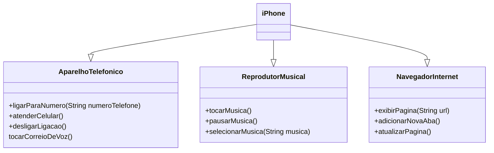

# Diagramação de funcionalidades do iPhone

```mermaid
classDiagram
    iPhone --|> AparelhoTelefonico
    iPhone --|> ReprodutorMusical
    iPhone --|> NavegadorInternet
    
    class ReprodutorMusical{
      +tocarMusica()
      +pausarMusica()
      +selecionarMusica(String musica)
    }
    class AparelhoTelefonico{
      +ligarParaNumero(String numeroTelefone)
      +atenderCelular()
      +desligarLigacao()
      tocarCorreioDeVoz()
    }
    class NavegadorInternet{
      +exibirPagina(String url)
      +adicionarNovaAba()
      +atualizarPagina()
    }
```
